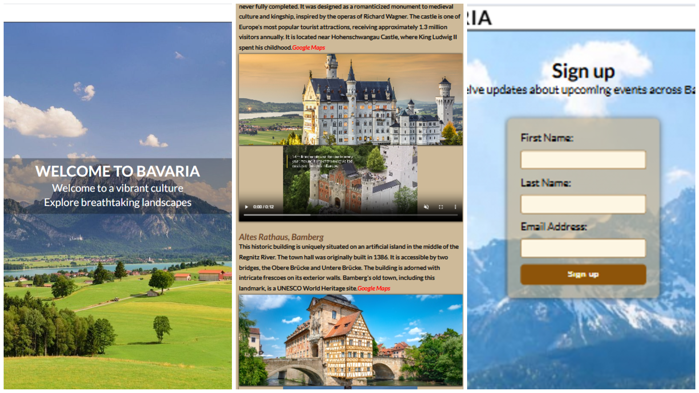
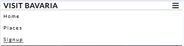

# visit-bavaria-redo
 ## Description
 A website dedicated to exploring the rich history of Bavaria, designed with accessibility, user experience, and responsivity at its core. The project provides reliable, evidence‑based information about artefacts, people, places, and events, supported by timelines, images, and videos. It is a simple, accessible, and semantically structured site that showcases famous landmarks across Bavaria, with styled sections for media and a signup form where users can subscribe to updates about upcoming events.

## Features
### Existing Features
- Navigation bar
  - A fixed, accessible navigation bar is included at the top of the site, allowing users to quickly move between sections such as homepage, places/landmarks and       signup.
  - This feature ensures visitors can easily explore without losing their place, improving overall user experience and making the site intuitive.
    
    
- Footer with Social Media Links  
  - Provides quick access to Facebook, YouTube, Instagram, and Twitter.
  - This feature helps users stay connected with updates across multiple platforms, extending engagement beyond the website itself.
  - By offering direct links to social channels, the site encourages ongoing interaction and community building for visitors who want to follow events and stories      in real time.

- Signup Form  
  - A well-structured form collects first name, last name, and email.
  - Required fields ensure valid submissions, helping users register for updates about Bavarian events.

- Homepage Hero Image  
The homepage opens with a full‑height background image that sets the tone for the site.
  - It provides an immediate visual connection to Bavaria’s landscapes and draws users into the experience.
  - The hero image helps visitors feel immersed in the theme of Bavaria.
 
- Embedded Videos  
  - The places/landmarks section includes embedded videos that give users a dynamic way to experience Bavaria’s cultural heritage.
  - Unlike static images, these videos provide movement, atmosphere, and context — helping visitors feel more connected to the places and events being showcased.     - This feature is especially valuable for users who want to immerse themselves visually and aurally in Bavarian history, making the site more engaging and            memorable.
   
- Landmark Descriptions in Text Form  
  - Each landmark is accompanied by a short written description that provides historical context and key details.
  - These text snippets give users reliable, evidence‑based information to complement the visual media, helping them understand why each site is significant.
  - This feature is especially valuable for visitors who want more than just images or videos.
  - It ensures the site serves as both an educational resource and a visually engaging experience.

